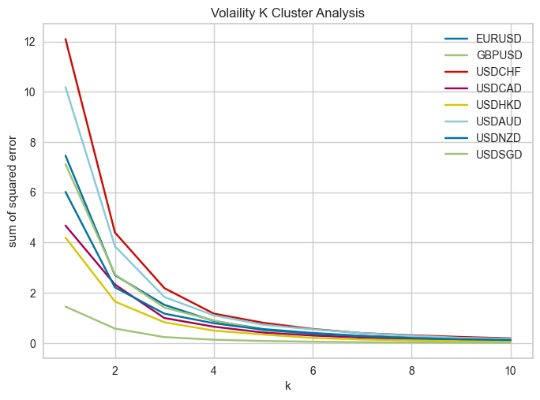

# Real-Time Traliling Stops Strategy Using Regression 

**Objective:** Collected and trained Forex Currency data to build an optimized trailing-stops strategy to make real-time investment decisions.


## Installation

Install the necessary python packages 

```bash
  $ pip install -r requirements.txt
```
    
## Project Description 

1. Collected 40 hours (144,000 rows of raw data) of 8 currency pairs quotes through polygon API. Cleaned, calculated, and updated key features to databases in real time every 6 minutes. 
    - Timestamp (𝑇)
    - Mean price (𝑃),
    - Maximum price (MAX),
    - Minimum price (MIN),
    - Volatility (VOL = (MAX–MIN)/𝑃),
    - Fractal dimension (FD) calculated with a counting process on a modified Ketner Channel 
    - Return (𝑅𝑖=(𝑃𝑖−𝑃𝑖−1)/𝑃i-1)

      ***Example of cleaned EUR-USD quotes (updated every 6 min):*** 
      
1. Trained each currency pair, and stored the optimized regression models. (The models performance wasn't optimum may due to small amount of training data (400 data after cleaning and aggregation)). I proceeded the modeling steps presented in [Trailing Stops 2](./detail_descriptions/Trailing%20Stops%202.pdf).
    - I additionally explored the assumption that whether the clustered volatility and Fractal Dimension have a linear relationship with the currency returns when presented in big data. I did an exploratory data analysis on 8 currency pairs that I gathered, and found the optimal number of clusters using the Elbow Method.  

    
    
    
    - I used the mean fix rate, the clustered Volatility and Fractal Dimension to model the return. My modeling result indicates that there are no linear relationships. The model did not perform great may due to reasons like the lack of data. In order to form clear clusters, we need to collect large-scale data, and that's beyond the scope of this project. However, for future improvement, I can download more data by using AWS Lambda and cloud virtual instances (AWS or GCP) to schedule and run my code over the cloud.


1. Built an optimized real-time trailing-stop strategy, and used our model predictions to make real-time investment decisions. We used the go long and go short strategies, and we will make hourly investment decisions based on our model predictions, modeling errors, and actual returns. Details of the trailing-stop strategy in [Trailing Stops 1](./detail_descriptions/Trailing%20Stops%201.pdf) and [Trailing Stops 3](./detail_descriptions/Trailing%20Stops%203.pdf)

      ***Example of EUR-USD models prediction table (updated every 6 min):***

      

      
      ***Example of EUR-USD trailing-stop investment strategy table (Go Long) (updated every hour):***
      

      ***Example of USD-AUD trailing-stop investment strategy table (Go short) (updated every hour):***
      

For the details of codes, Checked out [README.MD](https://github.com/Felix-only/-Real-Time-Trailing-Stops-Strategy-Using-Regression/blob/master/notebooks/README.md) in the **notebooks folder**.

The [**output_csv folder**](./output_csv) contains 10 hours of Forex currencies investments simulation results.

For the detail schema of the project, check out the PDF documents in the [**detail_descriptions**](./detail_descriptions) folder.


 

